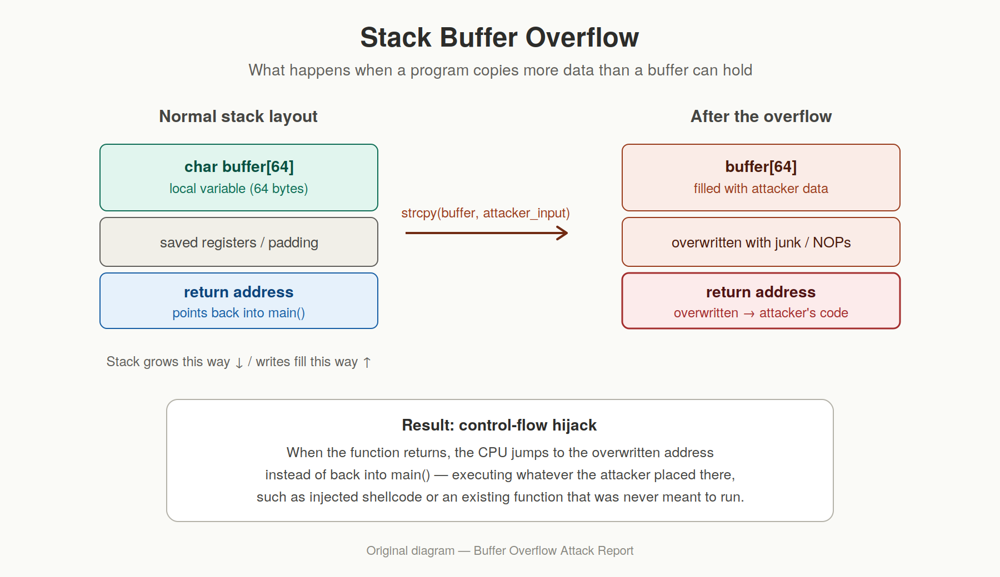

# Buffer Overflow Attacks: How a Few Extra Bytes Can Compromise a Whole System

---

## Introduction

Somewhere in almost every piece of software ever written, there is a small,
fixed-size block of memory called a **buffer**. It might hold a username
typed into a login form, a chunk of a file being read off disk, or a packet
arriving over the network. Buffers are mundane — until a program forgets to
check whether the data it is copying into one actually fits.

A **buffer overflow** occurs when a program writes more data into a buffer
than the buffer was allocated to hold, causing the excess bytes to spill
into adjacent memory. That adjacent memory might be another variable, a
pointer, or — in the worst case — the address the CPU is supposed to jump
to next. When an attacker can control *what* those overflowing bytes are,
a simple bug in a bounds check can turn into full control of the program's
execution flow.

Buffer overflows are one of the oldest and most persistent vulnerability
classes in computer security. They have been implicated in some of the
most disruptive security incidents in the history of the internet, and
despite decades of tooling, language design, and awareness, they still
appear regularly in vulnerability databases today. This post walks through
what buffer overflows are, why they happen, what exploiting one actually
looks like, the historical incidents that put them on the map, and the
modern techniques used to prevent them.

---

## 1. What Is a Buffer Overflow, and Why Does It Matter?

A buffer is simply a contiguous region of memory reserved to store data of
a known, fixed size — for example, a 64-byte array meant to hold a
username. In low-level languages like C and C++, the programmer is
responsible for making sure that no more than 64 bytes are ever written
into that array. The language itself does not stop you from writing byte
65, 66, or 6,000 — it will happily let the write happen, silently
corrupting whatever memory comes after the buffer.

This matters because a program's memory is not a random assortment of
unrelated data. It is laid out in a predictable structure that includes:

- **Local variables** of the current function
- **Saved CPU register values** needed to resume the calling function
- **The return address** — the location in the program the CPU should jump
  back to once the current function finishes
- **Pointers** to other data structures, including function pointers that
  determine what code runs next
- **Heap metadata** describing the size and status of dynamically allocated
  memory blocks

If a buffer overflow overwrites any of these, the consequences range from
a simple crash to a complete hijacking of the program's control flow. In
security terms, the potential consequences include:

- **Denial of service** — the simplest outcome; corrupted memory causes
  the program to crash, taking down a service.
- **Information disclosure** — in some variants (like buffer *over-reads*,
  e.g. the Heartbleed bug discussed below), the bug leaks memory contents
  back to the attacker instead of writing to them.
- **Arbitrary code execution** — the most severe outcome. By carefully
  crafting the overflow's contents, an attacker can overwrite a return
  address or function pointer so that the CPU jumps into code the attacker
  supplied, effectively running their own program inside the victim
  process.
- **Privilege escalation** — if the vulnerable program runs with elevated
  privileges (root, SYSTEM, a database service account, etc.), code
  execution inside it inherits those privileges.
- **Persistence and lateral movement** — once an attacker has code
  execution, the compromised machine can be used as a foothold to install
  backdoors or attack other systems on the same network.

Because so much widely deployed, security-critical software (operating
system kernels, web servers, network daemons, embedded firmware) is still
written in C and C++, buffer overflows remain directly relevant to modern
security — not just a historical curiosity.

---

## 2. How Buffer Overflows Actually Occur

To understand a buffer overflow, it helps to understand two regions of a
process's virtual memory where buffers commonly live: **the stack** and
**the heap**.



### The stack

Every time a function is called, the program pushes a new **stack frame**
onto the call stack. That frame typically contains the function's local
variables, followed (depending on architecture and compiler) by saved
register values and the **return address** — the instruction pointer value
the CPU will jump back to once the function returns.

Crucially, on most common architectures, the stack grows *downward*
(toward lower memory addresses), while an array written to with something
like `strcpy()` fills *upward* (toward higher addresses) from its start.
That means a local buffer sitting below the return address on the stack,
when overflowed, writes forward directly into the saved return address.

A classic vulnerable pattern:

```c
#include <string.h>

void vulnerable_function(char *user_input) {
    char buffer[64];
    strcpy(buffer, user_input);  /* no bounds checking! */
}
```

`strcpy()` copies bytes from `user_input` into `buffer` until it hits a
null terminator — it has no idea `buffer` is only 64 bytes long. If
`user_input` is 200 bytes, the extra 136 bytes overwrite whatever comes
next on the stack, which may well include the return address.

### The heap

Buffers allocated dynamically with `malloc()` live on the **heap**, a
region of memory the program can grow at runtime (via the `brk`/`sbrk` or
`mmap` system calls) to hold data whose size isn't known at compile time.
Heap buffers sit alongside allocator metadata (bookkeeping the allocator
uses to track chunk sizes and free lists) and other heap-allocated
objects. Overflowing a heap buffer can corrupt that metadata or overwrite
adjacent objects — including, in dynamic languages, string or object data
that the interpreter itself trusts.

This is directly demonstrable without even crafting an "attack": in the
companion task for this project, we wrote `read_write_heap.py`, a script
that opens a target process's `/proc/[pid]/maps` file to locate its
`[heap]` memory region, then opens `/proc/[pid]/mem` and writes directly
into that address range to overwrite a known ASCII string:

```python
mem_file.seek(start)
heap_data = mem_file.read(end - start)
offset = heap_data.find(search_bytes)
found_addr = start + offset
mem_file.seek(found_addr)
mem_file.write(replace_bytes)
```

That exercise is a benign, deliberate version of exactly the primitive an
attacker relies on: the ability to locate a specific byte range in a
running process's memory and overwrite it. The only difference between
that script and a real heap-based exploit is *intent* and *what gets
written* — a legitimate script controlled by the process owner versus
attacker-supplied input that a vulnerable program copies into a
heap buffer without checking its length.

### The common thread

In both cases, the underlying mistake is the same: **the program trusts
that incoming data will fit into a fixed-size destination, and never
verifies that assumption before copying.** Functions in the C standard
library that are especially notorious for enabling this include `strcpy`,
`strcat`, `sprintf`, and `gets` — none of them take a destination size
argument, so none of them can stop themselves from writing past the end of
a buffer.

---

## 3. A Simplified Exploitation Example

Let's walk through a simplified (and intentionally non-weaponized)
illustration of how a stack buffer overflow can hijack control flow.
Consider this program:

```c
#include <stdio.h>
#include <string.h>

void secret_function(void) {
    printf("You should never see this!\n");
    /* imagine this prints a flag, spawns a shell, etc. */
}

void greet(char *name) {
    char buffer[32];
    strcpy(buffer, name);   /* vulnerable copy, no length check */
    printf("Hello, %s!\n", buffer);
}

int main(int argc, char *argv[]) {
    if (argc > 1) {
        greet(argv[1]);
    }
    printf("Goodbye.\n");
    return 0;
}
```

Under normal use, `greet()` copies a short name into `buffer` and prints a
friendly message. `secret_function()` is never called by any code path —
there is no `call secret_function` instruction anywhere in `main()` or
`greet()`.

But because `strcpy()` doesn't respect the 32-byte size of `buffer`, an
attacker who controls `argv[1]` can supply a string long enough to:

1. Fill the 32 bytes of `buffer`.
2. Overwrite any saved registers and padding between `buffer` and the
   return address (this offset is found through trial and error, or by
   examining the compiled binary with a debugger).
3. Overwrite the **return address** itself with the memory address of
   `secret_function()`.

When `greet()` finishes and executes its `ret` instruction, the CPU does
not return to `main()` as the source code implies — it jumps to whatever
address was written into that memory slot, which the attacker has set to
`secret_function()`. The program now executes code the original developer
never intended to run from that point, purely because of a carefully
sized and positioned input string.

In a real-world exploit the attacker typically doesn't redirect execution
to an existing function like `secret_function()` — they inject their own
machine code (**shellcode**) into the buffer itself and point the return
address at *that*, giving them arbitrary code execution rather than being
limited to functions that already exist in the binary. Modern defenses
(covered in Section 5) specifically target this technique by making
injected memory non-executable and making addresses unpredictable.

---

## 4. Historical Significance: Buffer Overflows That Changed the Industry

Buffer overflows aren't an abstract textbook risk — they have driven some
of the most consequential security events in computing history.

### The Morris Worm (1988)

Widely considered the first major worm to spread across the early
internet, the Morris Worm exploited, among other vulnerabilities, a
buffer overflow in the Unix `fingerd` daemon. By sending a specially
crafted request that overflowed a fixed-size buffer, the worm could
inject and execute its own code on vulnerable machines, then use the
newly compromised host to scan for and infect other systems. Within
about 24 hours it had infected an estimated 10% of the internet-connected
computers that existed at the time — a number that sounds small today but
represented a huge fraction of the network. The incident is widely
credited with prompting the creation of the first Computer Emergency
Response Team (CERT) and marked the moment the tech industry began taking
software security seriously as a discipline in its own right.

### Code Red and SQL Slammer (2001–2003)

Code Red exploited a buffer overflow in Microsoft's IIS web server,
compromising hundreds of thousands of machines within hours and using
them to launch denial-of-service attacks against government websites.
SQL Slammer, in 2003, exploited a buffer overflow in Microsoft SQL Server
and became one of the fastest-spreading worms ever recorded, doubling its
infected population roughly every 8.5 seconds and causing widespread
internet slowdowns worldwide within minutes of its release. Both are
textbook demonstrations of how a single unchecked memory copy in
widely-deployed server software can cascade into global-scale disruption.

### Heartbleed (2014)

Heartbleed is a slightly different — but closely related — flavor of the
same underlying mistake: a **buffer over-read** rather than a buffer
over-write. It lived in OpenSSL's implementation of the TLS "heartbeat"
extension. A client could send a heartbeat request claiming a payload
length larger than the data it actually sent; the server, trusting the
claimed length without validating it against the buffer's real size,
would read *past* the end of the buffer and echo the extra memory back to
the client. That extra memory could contain anything sitting nearby in
the server's process — including private encryption keys, session
cookies, and user passwords. Because OpenSSL was (and still is) used by a
huge share of the web's HTTPS infrastructure, Heartbleed is estimated to
have affected roughly half a million of the internet's most trusted
websites at the time of disclosure, and it triggered a mass, industry-wide
scramble to patch servers and rotate compromised credentials.

Together, these incidents illustrate the same lesson from different
angles: whether the mistake is a write past the end of a buffer or a read
past the end of one, unchecked buffer boundaries in widely-used software
have repeatedly produced internet-scale consequences.

---

## 5. Practical Mitigation Techniques

Decades of experience with buffer overflow incidents have produced a
layered set of defenses. No single technique is sufficient on its own —
modern secure systems combine several of the following:

### Secure coding practices

- **Use bounds-checked functions.** Replace `strcpy`/`strcat`/`sprintf`
  with their length-limited counterparts (`strncpy`, `strncat`,
  `snprintf`), or better, higher-level string types (C++ `std::string`,
  Rust `String`) that manage their own memory and refuse to overflow.
- **Validate all input lengths explicitly** before copying into a
  fixed-size destination, rather than trusting caller-supplied length
  fields (this is exactly the mistake behind Heartbleed).
- **Prefer memory-safe languages where possible.** Languages like Rust,
  Go, Python, and Java either make out-of-bounds access a compile-time
  error or enforce bounds checks at runtime, eliminating the class of bug
  entirely for code written in them. This is why so much new
  security-critical software (e.g. parts of the Linux kernel, Firefox's
  media parsers, and various cloud infrastructure components) has been
  migrating to Rust in recent years.

### Compiler and toolchain protections

- **Stack canaries.** The compiler inserts a random, secret value between
  local buffers and the saved return address. Before a function returns,
  it checks whether the canary value has changed; if it has, the program
  assumes a stack overflow occurred and aborts rather than executing a
  corrupted return address. (Enabled with `-fstack-protector` /
  `-fstack-protector-all` on GCC/Clang.)
- **Address Space Layout Randomization (ASLR).** The operating system
  randomizes the base addresses of the stack, heap, and shared libraries
  on every run. This makes it much harder for an attacker to know in
  advance where their injected shellcode or a useful existing function
  will end up in memory, since a hardcoded address from a previous run
  won't be reliable.
- **Data Execution Prevention / the NX (No-eXecute) bit.** Marks memory
  regions like the stack and heap as non-executable at the hardware
  level, so even if an attacker successfully writes shellcode into a
  buffer, the CPU refuses to execute it as instructions.
- **Fortify Source (`_FORTIFY_SOURCE`)** and similar compiler flags add
  extra runtime checks to common unsafe library functions where the
  buffer size can be inferred at compile time.

### Testing and analysis

- **Static analysis tools** (e.g. `cppcheck`, Clang Static Analyzer,
  Coverity) scan source code for unsafe patterns — like calls to
  `strcpy` with an attacker-influenced source — without ever running the
  program.
- **Dynamic analysis and sanitizers**, such as AddressSanitizer (ASan),
  instrument a compiled binary to detect out-of-bounds reads and writes
  the instant they happen during testing, rather than relying on a crash
  to eventually surface the bug.
- **Fuzzing** — automatically generating large volumes of malformed or
  boundary-case input and feeding it to a program to surface crashes —
  has become a standard part of the development lifecycle for
  security-sensitive C/C++ projects (Google's OSS-Fuzz project alone has
  found tens of thousands of bugs, many of them buffer overflows, across
  major open-source projects).

### Operational practices

- **Principle of least privilege.** Running services under a low-privilege
  account limits the blast radius if a buffer overflow is successfully
  exploited — the attacker inherits only the privileges of the
  compromised process.
- **Regular patching.** Many of the historically significant incidents
  above (including Heartbleed) had patches available quickly after
  disclosure; the organizations that suffered the most damage were
  typically the ones slow to apply them.
- **Code review**, especially for any code that parses external input —
  network protocols, file formats, user-supplied strings — with a
  specific eye toward every place a fixed-size buffer receives
  variable-length data.

No individual defense is bulletproof on its own — ASLR can sometimes be
defeated with an information leak, stack canaries don't protect against
heap overflows, and even memory-safe languages have `unsafe` escape
hatches. The real-world answer is **defense in depth**: combining secure
coding habits, compiler protections, OS-level mitigations, and rigorous
testing so that a single missed bounds check doesn't translate directly
into a compromised system.

---

## Conclusion

Buffer overflows sit at the intersection of a simple programming mistake
and a uniquely severe consequence: because computer memory is a flat,
shared space where code, data, and control-flow information all live side
by side, forgetting to check the size of a copy can hand an attacker the
ability to redirect a program's execution entirely. From the Morris Worm
in 1988 to Heartbleed in 2014, the pattern has repeated across three
decades of software — and the underlying cause is almost always the same
handful of lines of code that trusted input a little too much.

The good news is that this is also one of the most heavily studied and
mitigated vulnerability classes in security. Between memory-safe
languages, compiler hardening, OS-level protections like ASLR and NX, and
mature testing tools like sanitizers and fuzzers, it is entirely possible
to build software that is dramatically more resistant to buffer overflow
exploitation than the software of the 1980s and 90s. The exercise of
manually locating and overwriting a string in a running process's heap —
as we did in the companion `read_write_heap.py` script for this project —
is a useful reminder of just how directly accessible a process's memory
really is, and why treating every buffer boundary as untrusted, every
single time, remains one of the most important habits in secure software
development.

---

*This post was written as part of the Cybersecurity
Academy's Linux Security track, Buffer Overflow project.*
