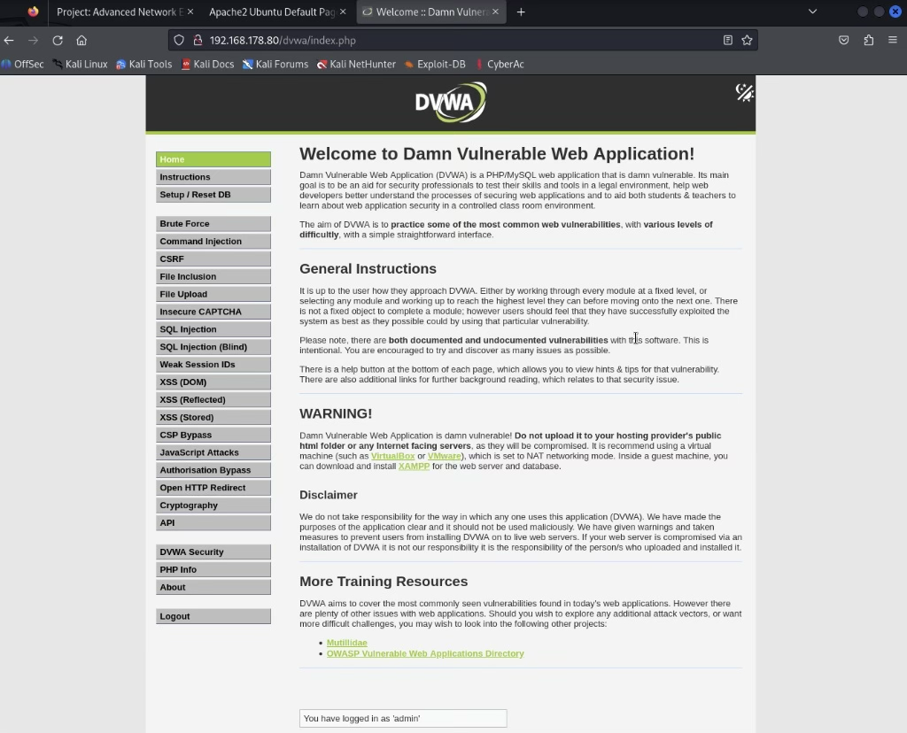
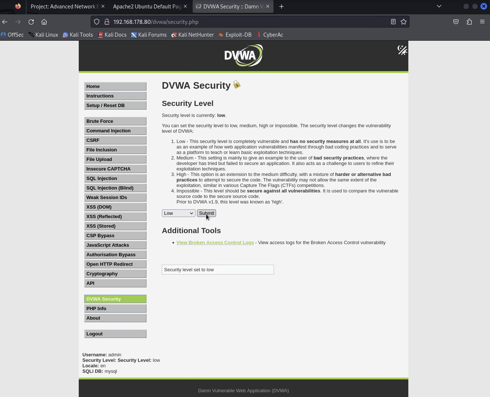
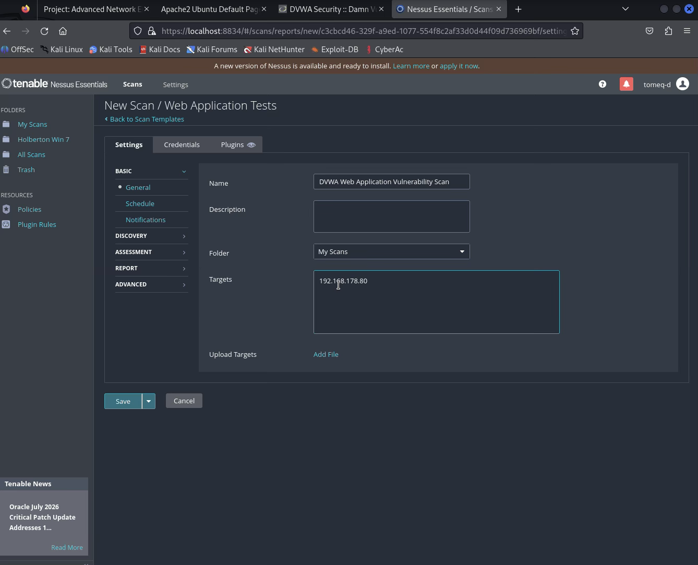
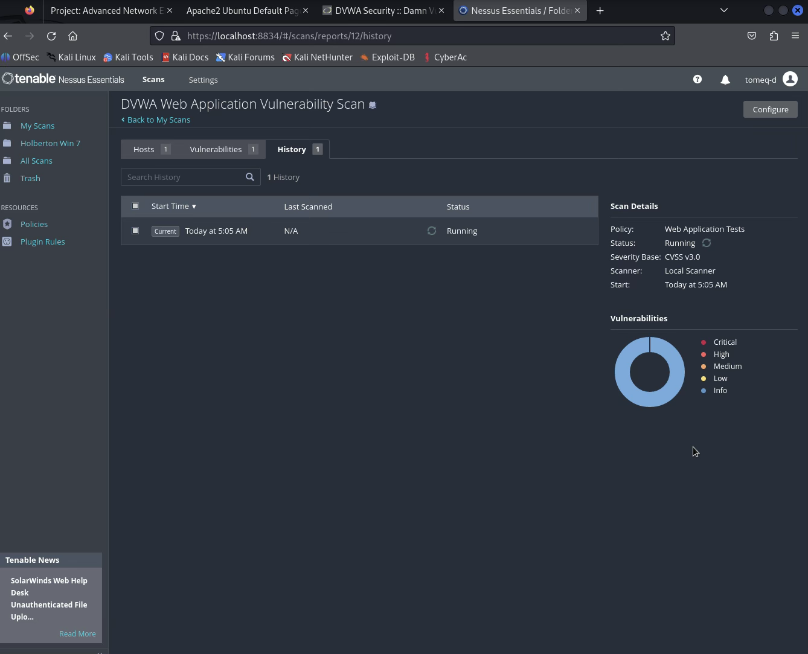
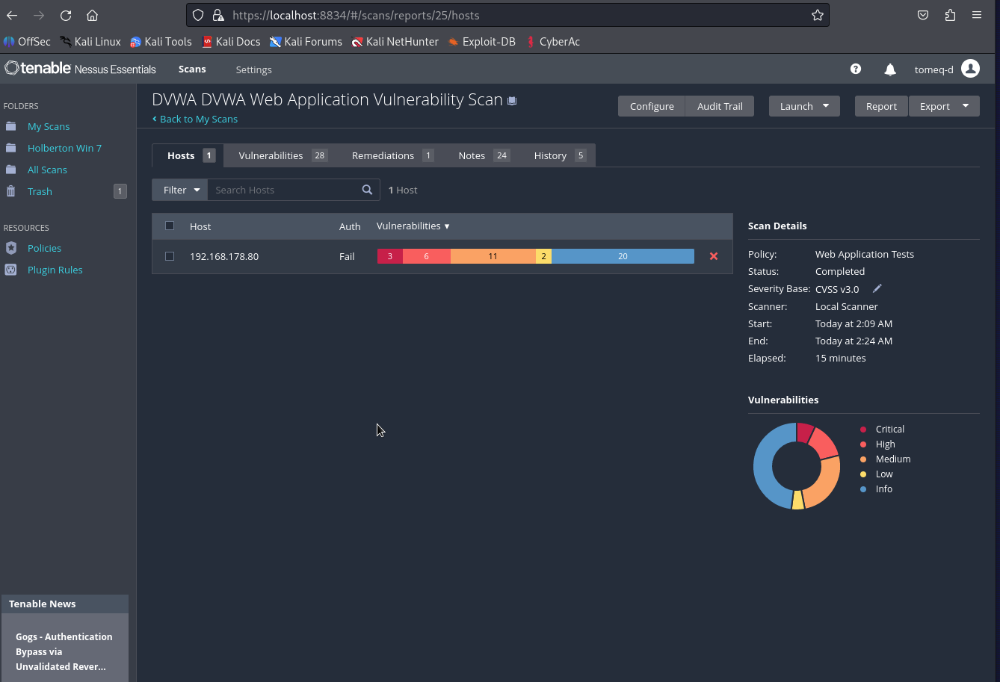
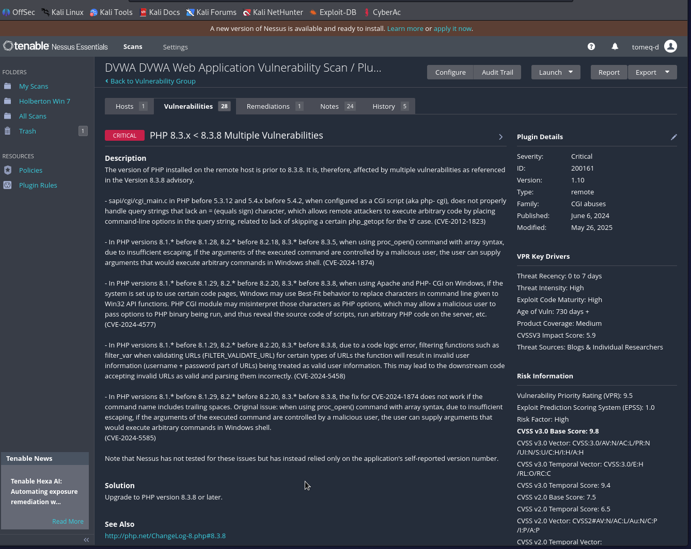
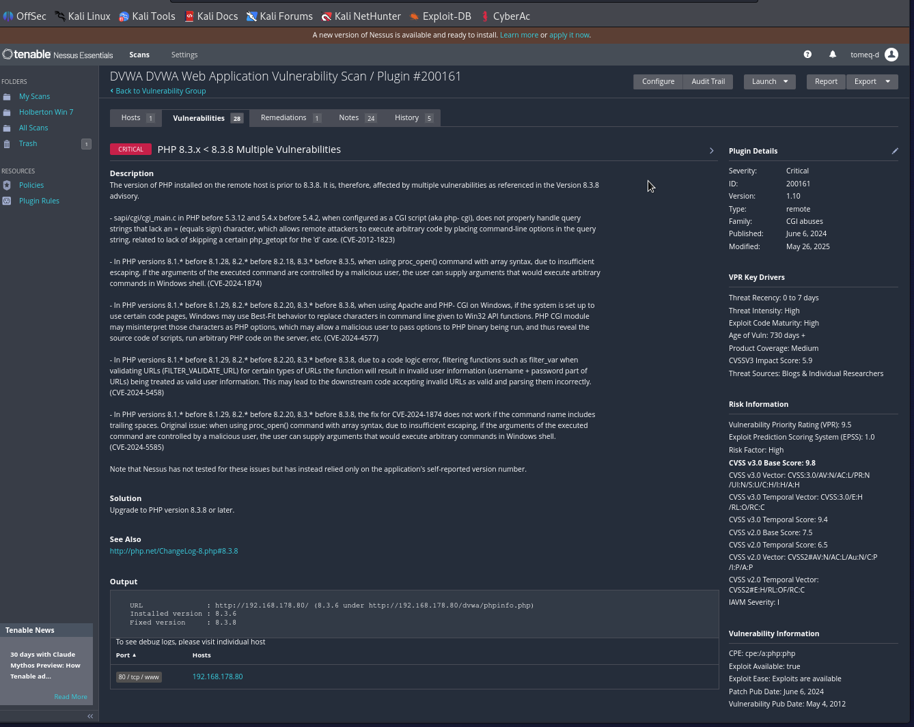
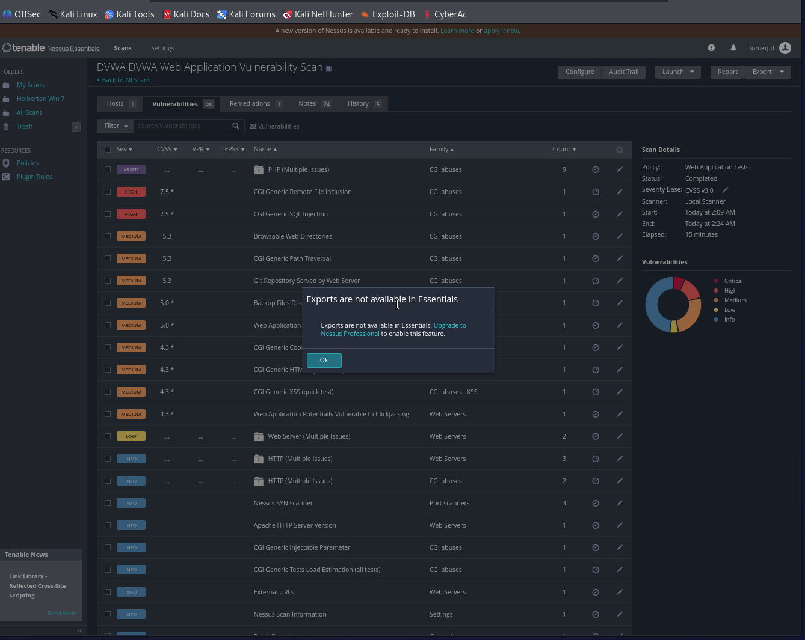

# Task 0: Web Application Scan on DVWA

*Vulnerability scanning with Nessus Essentials*

## Lab Information

| Field | Value |
|---|---|
| Scanner | Nessus Essentials on Kali Linux |
| Target | DVWA on Ubuntu Server (VirtualBox VM, separate host) |
| Target IP | 192.168.178.80 |
| Target URL | http://192.168.178.80/dvwa/ |
| Nessus Template | Web Application Tests |

---

## Section 1 — Preparing DVWA

**Steps performed:**
1. Opened the web browser on Kali Linux and navigated to the DVWA URL.
2. Logged in to the application (`admin`).
3. Confirmed the DVWA database was initialized.
4. Set DVWA Security Level to **Low**.

**Screenshot — DVWA dashboard after login:**

**Screenshot — Security level confirmed as Low:**

---

## Section 2 — Scan Configuration

**Steps in Nessus:**
1. Accessed the Nessus web interface.
2. Created a new scan.
3. Selected the **Web Application Tests** template.
4. Configured scan settings — target, cookie-based authentication, and crawl start path.
5. Saved the scan configuration.

### Scan Settings Record

| Setting | Value |
|---|---|
| Scan Name | DVWA Web Application Vulnerability Scan |
| Target URL | 192.168.178.80 (crawl scoped to `/dvwa/` via Assessment → Web Applications → *Start crawling from*) |
| Scan Type | Web Application Tests (Custom) |
| Port Range | Port scan (common ports) |

**Note on target configuration:** Nessus's Targets field only accepts a bare host/IP (optionally with `:port`), not a full URL with a path. The `/dvwa/` application path was instead set as the web crawler's starting point under **Settings → Assessment → Web Applications → Start crawling from**, after switching the Scan Type from the default "quick" preset to **Custom** (which exposes that field for editing).

**Note on authentication:** DVWA's login form includes a per-load CSRF token, which prevents Nessus's standard "HTTP login form" authentication method from succeeding. Authentication was instead configured via **HTTP cookies import**, using a manually-built Netscape-format cookie file (`PHPSESSID` + `security=low`) captured from an active, verified-authenticated browser session.

**Screenshot — Scan configuration page:**

---

## Section 3 — Scan Execution

**Steps performed:**
1. Launched the scan.
2. Monitored scan progress.
3. Waited until scan completion.

### Scan Monitoring Record

| Metric | Value |
|---|---|
| Start Time | 2:09 AM |
| End Time | 2:24 AM |
| Duration | 15 minutes |
| Status | Completed |

**Screenshot — Scan running status:**

*(Captured from an earlier configuration attempt in the same scan's troubleshooting history, before the target/crawl-path/authentication settings above were finalized; included to satisfy the "running" state requirement since the completed run's own in-progress state was not separately captured.)*

**Screenshot — Scan completed status:**

---

## Section 4 — Results Analysis

### 4.1 Vulnerability Overview

| Severity | Count |
|---|---|
| Critical | 3 |
| High | 6 |
| Medium | 11 |
| Low | 2 |
| Informational | 20 |
| **Total** | **42** |

*Note: Nessus's severity donut/bar counts every finding instance (42), while the Vulnerabilities tab groups findings by unique plugin (28 unique plugins). Both figures are correct — they reflect two different counting methods within the same scan.*

**Screenshot — Nessus severity summary:**

### 4.2 Critical and High Vulnerabilities

| # | Vulnerability Name | Severity | CVE | Service |
|---|---|---|---|---|
| 1 | PHP 8.3.x < 8.3.8 Multiple Vulnerabilities | Critical (CVSS 9.8) | CVE-2012-1823, CVE-2024-1874, CVE-2024-4577, CVE-2024-5458, CVE-2024-5585 | 80/tcp/www (HTTP) |
| 2 | PHP 8.3.x < 8.3.31 Multiple Vulnerabilities | Critical (CVSS 9.8) | Not individually listed (see plugin references) | 80/tcp/www (HTTP) |
| 3 | PHP 8.3.x < 8.3.14 Multiple Vulnerabilities | Critical (CVSS 9.8) | Not individually listed (see plugin references) | 80/tcp/www (HTTP) |
| 4 | PHP 8.3.x < 8.3.12 Multiple Vulnerabilities | High (CVSS 8.8) | CVE-2024-8925, CVE-2024-8926, CVE-2024-8927, CVE-2024-9026 | 80/tcp/www (HTTP) |
| 5 | PHP 8.3.x < 8.3.29 Multiple Vulnerabilities | High (CVSS 8.2) | CVE-2025-14177, CVE-2025-14178, CVE-2025-14180 | 80/tcp/www (HTTP) |

*All Critical/High findings in this scan stem from the same root cause: the target's installed PHP version (8.3.6) is behind several PHP 8.3.x maintenance releases, each of which bundled its own set of CVE fixes. Nessus reports each unpatched release boundary as a separate finding.*

**Screenshot — Filtered vulnerability list (Critical/High):**

### 4.3 Deep Dive — One Vulnerability

**Selected finding: PHP 8.3.x < 8.3.8 Multiple Vulnerabilities (Plugin #200161)** — highest-severity finding in the scan.

| Field | Detail |
|---|---|
| Plugin Name | PHP 8.3.x < 8.3.8 Multiple Vulnerabilities |
| CVE ID | CVE-2012-1823, CVE-2024-1874, CVE-2024-4577, CVE-2024-5458, CVE-2024-5585 |
| Plugin ID | 200161 |
| Plugin Family | CGI abuses |
| Severity | Critical |
| CVSS Score | 9.8 (CVSS v3.0 Base) — Vector: `CVSS:3.0/AV:N/AC:L/PR:N/UI:N/S:U/C:H/I:H/A:H` |
| Affected Host | 192.168.178.80 |
| Port / Service | 80/tcp/www (HTTP) |
| Synopsis | The remote web server uses a version of PHP affected by multiple vulnerabilities. |
| Description | The installed PHP version (8.3.6, detected via the target's `phpinfo.php`) is prior to 8.3.8, and is therefore affected by several CVEs fixed in that release — including a legacy CGI query-string handling flaw (CVE-2012-1823) and several `proc_open()`/Windows Best-Fit codepage command-injection issues (CVE-2024-1874, CVE-2024-4577, CVE-2024-5458, CVE-2024-5585). Nessus based this finding on the self-reported version string rather than active exploitation. |
| Impact | Depending on server configuration, exploitation of these flaws could allow a remote, unauthenticated attacker to execute arbitrary commands or PHP code on the server via crafted query strings or command arguments. |
| Remediation | Upgrade PHP to version 8.3.8 or later. |
| References | http://php.net/ChangeLog-8.php#8.3.8 |

**Screenshot — Vulnerability detail page:**

---

## Section 5 — Report Export

**Steps performed:**
1. Opened the scan results.
2. Attempted the Export option.
3. **Result:** Nessus Essentials blocks all export formats — attempting Export (PDF, HTML, CSV, or .nessus) returns *"Exports are not available in Essentials. Upgrade to Nessus Professional to enable this feature."*
4. **Workaround:** Used the browser's built-in print-to-PDF function against the live scan results page (`Ctrl+P → Save as PDF`) to produce an accurate PDF capture of the scan data, since native Nessus report generation is not available on this license tier.

**Screenshot — Report export screen (Essentials limitation):**

**Exported report (browser print-to-PDF):** [`DVWA_Nessus_Results.pdf`](DVWA_Nessus_Results.pdf)

---

## Submission Checklist

- [x] DVWA prepared and accessible
- [x] Scan configured
- [x] Scan executed successfully
- [x] Scan monitoring data completed
- [x] Vulnerability summary filled
- [x] Critical/High table completed
- [x] Deep dive section completed
- [x] Nessus report exported (PDF, via browser print — native export unavailable in Essentials license)
- [x] All required screenshots included

---

## Notes on Environment & Troubleshooting

Two environment-specific issues had to be resolved during this task, worth documenting for anyone reproducing this lab:

1. **DVWA authentication:** DVWA's login form uses a per-page-load CSRF token, which Nessus's standard "HTTP login form" authentication cannot solve. Cookie-based authentication (HTTP cookies import, using a manually captured `PHPSESSID` + `security` cookie pair in Netscape format) was used instead.
2. **Crawl scope:** Nessus's Targets field only accepts a bare IP/hostname, not a URL with a path. The scan's crawl scope had to be set separately via **Settings → Assessment → Web Applications → Start crawling from** (`/dvwa/`), which required switching the Scan Type from the default "quick" preset to **Custom** to make that field editable.
