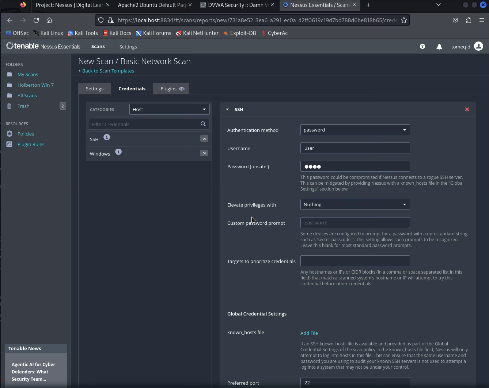
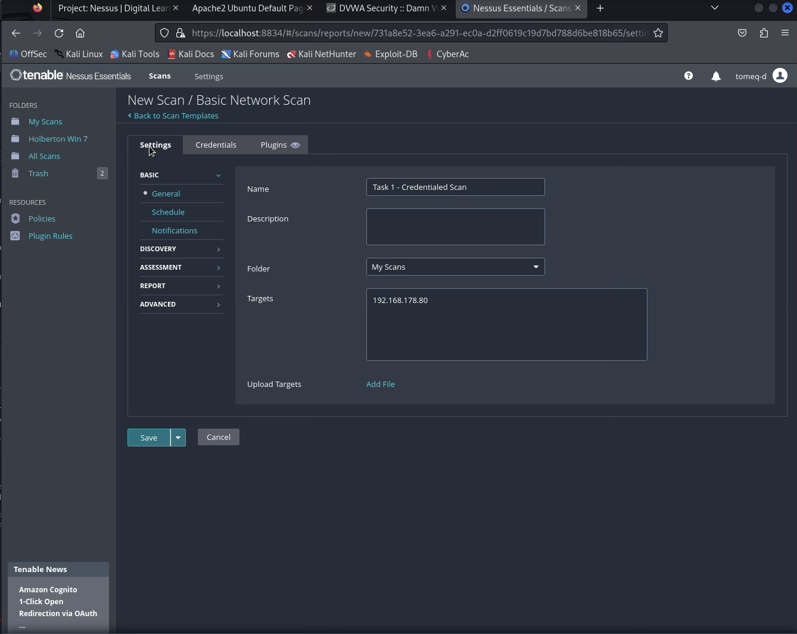
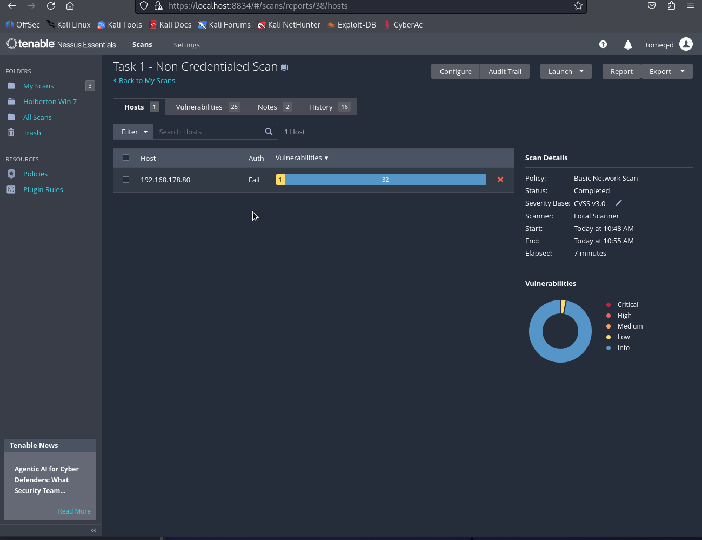
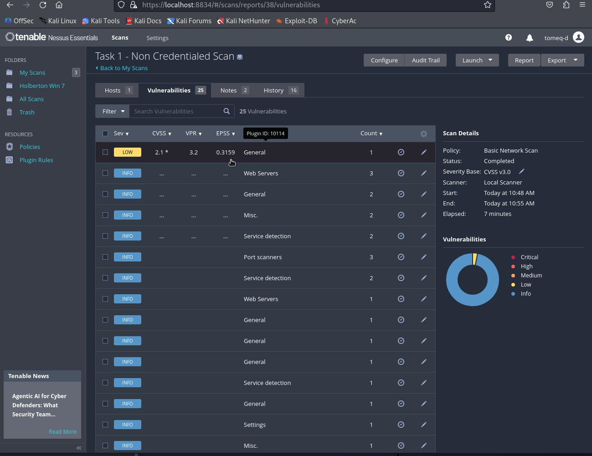
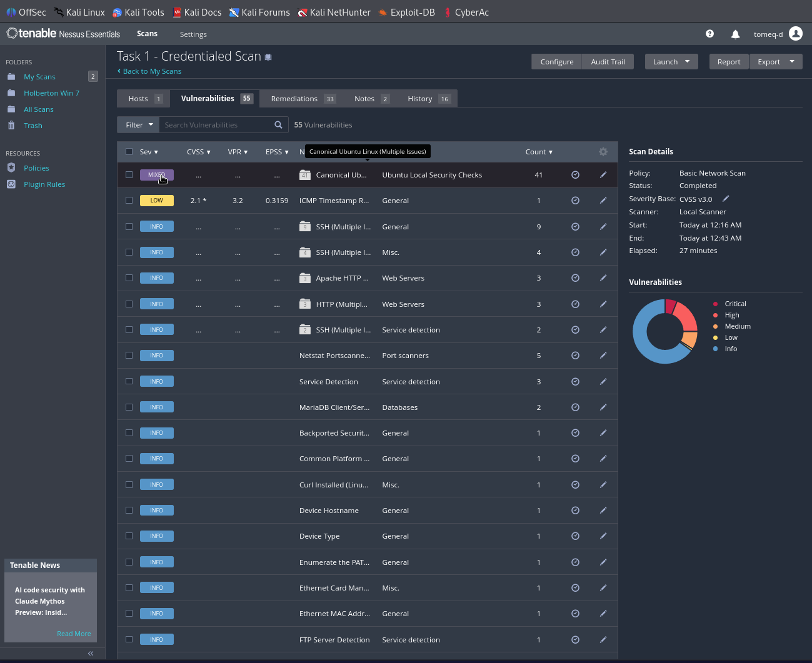
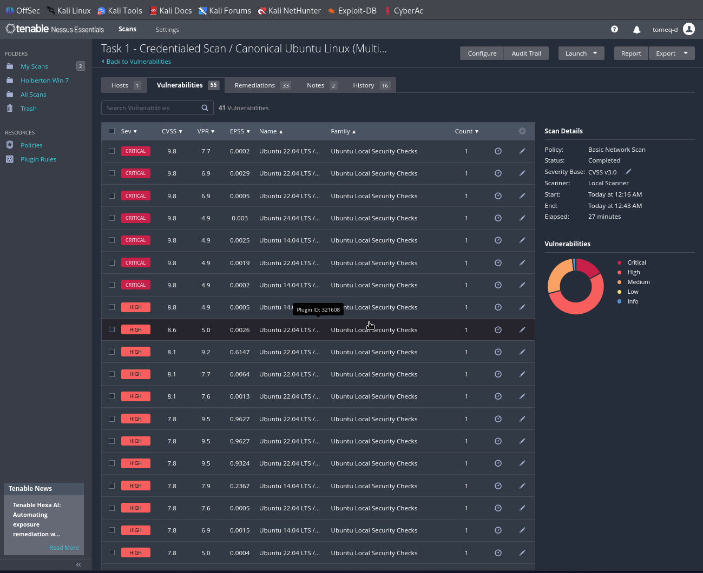
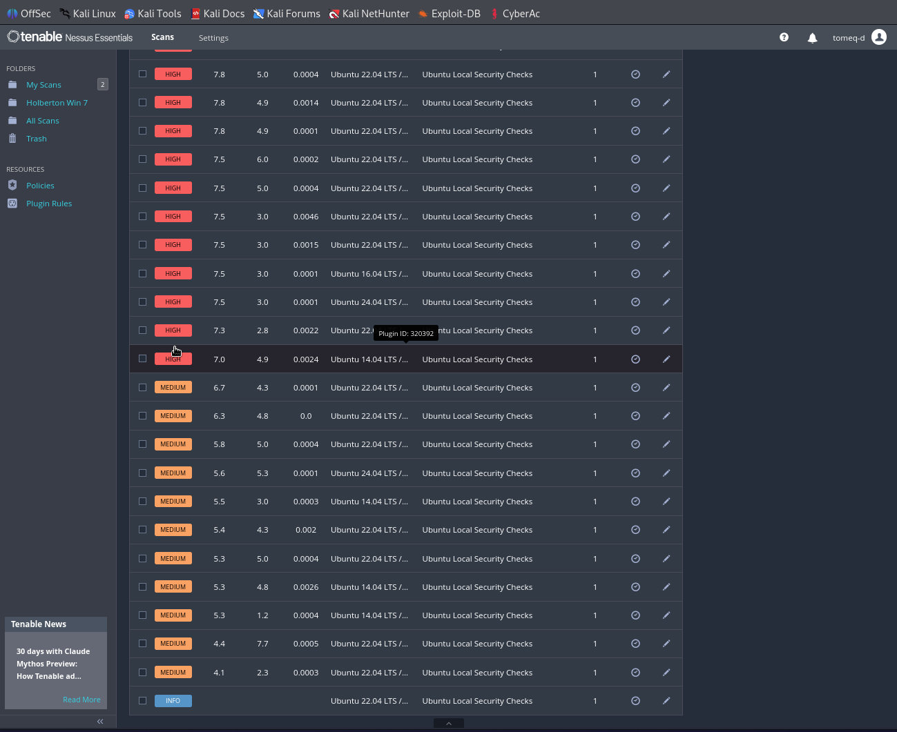
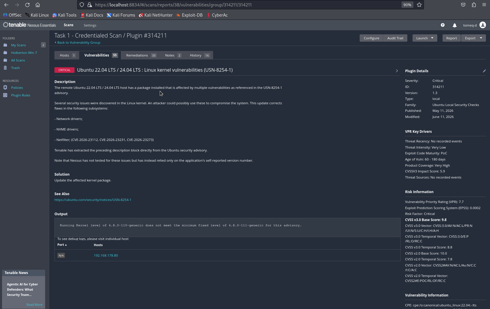

# Task 1 — Credentialed Scan & Local System Audit

*Nessus Vulnerability Assessment Report*

## 1.1 Lab Environment Setup

### Student Details

| Field | Value |
|---|---|
| Selected Target | Ubuntu Server (same VM used in Task 0) |
| Target IP Address | 192.168.178.80 |
| Nessus Version | Nessus Essentials 10.x |

**Environment note:** The task sheet's placeholder addresses (192.168.56.20 / 192.168.56.3) are VirtualBox host-only defaults. The actual lab target runs on a separate physical host reachable at `192.168.178.80` (the same Ubuntu Server VM used for the DVWA scan in Task 0), on the same LAN segment as the Kali scanner.

**Pre-Lab Checklist:**
- [x] Nessus Essentials installed and activated
- [x] Target VM powered on and reachable
- [x] Valid SSH credentials available (`user` / `user`, full sudo rights confirmed via `sudo -l`)
- [x] Nessus and target VM on the same network segment
- [x] Target IP address noted

**Connectivity confirmation:** Reachability and credential validity were confirmed directly via an interactive SSH session from Kali (`ssh user@192.168.178.80`, followed by `sudo -l`, which returned `(ALL : ALL) ALL`) before configuring Nessus, rather than via a standalone `ping` screenshot.

---

## 1.2 Configuring Credentials in Nessus

**Steps performed:**
1. Opened the scan's Credentials tab and selected credential type **SSH**.
2. Entered username `user` and password.
3. Set **Elevate privileges with** to `sudo`, with the escalation (sudo) password and "Account to escalate to" left as `root`.
4. Attached the credential to the **Basic Network Scan**.

### Credential Configuration Record

| Field | Value |
|---|---|
| Credential Type | SSH |
| Username | user |
| Authentication Method | Password |
| Elevate privileges with | sudo (escalate to root) |
| Target IP | 192.168.178.80 |
| Credential Verification | **Yes** — confirmed via Hosts tab **Auth: Pass**, and further confirmed by the presence of 41 "Ubuntu Local Security Checks" findings, a plugin family that cannot execute without successful privilege escalation |

**Screenshot — Nessus credential configuration screen:**

*Note: this screenshot was captured during initial setup, before the "Elevate privileges with" dropdown was set to `sudo` — an earlier attempt with escalation left at the default (`Nothing`) is what's pictured. The actual scan that produced the results below had `sudo` escalation correctly configured, as evidenced by the successful local checks (Ubuntu Local Security Checks family requires root-level file/package access, which is unreachable without escalation).*

### Troubleshooting note

The first credentialed scan attempt returned **Auth: Fail** despite correct credentials. Diagnosis (via the *SSH Commands Require Privilege Escalation* and later *Target Credential Issues — Intermittent Authentication Failure* findings) traced this to two separate causes encountered in sequence:

1. An initial typo/mismatch in the sudo escalation password field (fixed by re-entering it directly).
2. **fail2ban** on the Ubuntu target banning the Kali scanner's IP mid-scan, in response to the volume of rapid SSH connection attempts Nessus generates during a credentialed audit. This was confirmed by temporarily stopping `fail2ban` (`sudo systemctl stop fail2ban`) and re-running the scan, which resolved the issue and produced a full **Auth: Pass** result.

---

## 1.3 Scan Configuration & Execution

Template used: **Basic Network Scan**, with SSH credentials (sudo-escalated) attached. Target: 192.168.178.80.

**Screenshot — Scan settings page:**

### Scan Metrics

| Metric | Value |
|---|---|
| Scan Start Time | 12:16 AM |
| Scan End Time | 12:43 AM |
| Total Duration | 27 minutes |
| Hosts Scanned | 1 |

**Screenshot — Scan completion screen (credentialed):**

---

## 1.4 Results Analysis — Credentialed vs Unauthenticated

Both scans below use the **same template** (Basic Network Scan) against the **same host** (192.168.178.80) — the only variable changed is whether SSH credentials were attached, giving a clean, valid comparison (unlike Task 0's DVWA scan, which used a different template entirely and isn't a suitable baseline here).

| Severity | Credentialed Scan | Unauthenticated Scan |
|---|---|---|
| Critical | 7 | 0 |
| High | 22 | 0 |
| Medium | 11 | 0 |
| Low | 1 | 1 |
| Info | 77 | 32 |
| **TOTAL** | **118** | **33** |

**Screenshot — Unauthenticated scan completion screen:**

**Screenshot — Unauthenticated scan vulnerability list:**

**Screenshot — Credentialed scan vulnerability list:**

**Screenshot — Local Security Checks detail (Critical/High findings):**

### Three vulnerabilities found ONLY in the credentialed scan

| # | Vulnerability | Severity | Why it was hidden from the unauthenticated scan |
|---|---|---|---|
| 1 | **Ubuntu 22.04/24.04 LTS: Linux kernel vulnerabilities (USN-8254-1)** — CVE-2026-23112, CVE-2026-23231, CVE-2026-23273 | Critical (CVSS 9.8) | The installed kernel version/build (`6.8.0-110-generic`) can only be read locally via package metadata — nothing in the kernel's network-facing behavior reveals its exact patch level to a remote scanner. |
| 2 | **Ubuntu 22.04/24.04/25.10/26.04 LTS: PHP vulnerabilities (USN-8336-1)** — CVE-2025-14179, CVE-2026-6722, CVE-2026-6735, and others | Critical (CVSS 9.8) | Requires reading the installed PHP package version via the local package manager (`dpkg`); a web server banner alone doesn't expose the exact patch-level version needed to match this advisory. |
| 3 | **Ubuntu 22.04/24.04/25.10/26.04 LTS: Bind vulnerabilities (USN-8293-1)** — CVE-2026-3039, CVE-2026-3592, CVE-2026-5946, and others | Critical (CVSS 9.8) | Bind's DNS resolver package version is not exposed on any network-facing service the host runs; local package inspection is required to detect the vulnerable `bind9-libs`/`bind9-dnsutils` builds. |

All three were invisible to the unauthenticated scan for the same underlying reason: they are **local package/version audit findings**, a category that fundamentally requires the scanner to log in and read installed software state directly — no amount of network probing can substitute for it.

---

## 1.5 Deep Dive — One Local Vulnerability

**Selected finding: Ubuntu 22.04 LTS / 24.04 LTS: Linux kernel vulnerabilities (USN-8254-1) — Plugin #314211**

| Field | Detail |
|---|---|
| Plugin Name | Ubuntu 22.04 LTS / 24.04 LTS : Linux kernel vulnerabilities (USN-8254-1) |
| CVE ID | CVE-2026-23112, CVE-2026-23231, CVE-2026-23273 |
| Severity / CVSS | Critical — CVSS v3.0 Base Score 9.8 (`CVSS:3.0/AV:N/AC:L/PR:N/UI:N/S:U/C:H/I:H/A:H`) |
| Plugin Family | Ubuntu Local Security Checks |
| Plugin Output (summary) | `Running Kernel level of 6.8.0-110-generic does not meet the minimum fixed level of 6.8.0-111-generic for this advisory.` |
| Root Cause | Missing patch — the running kernel is one point release behind the version that fixes the referenced CVEs. |
| Potential Impact | The advisory covers flaws in the network drivers, NVMe drivers, and Netfilter subsystems. An attacker able to reach these code paths could potentially compromise the system; exploit code maturity is listed as PoC (proof-of-concept) with exploits available, meaning this is not purely theoretical. |
| Remediation Steps | Update the kernel package and reboot: `sudo apt update && sudo apt install linux-image-generic` (or the specific `6.8.0-111-generic` package), then `sudo reboot` to load the patched kernel — a package update alone does not take effect until the system restarts into the new kernel. |

**Screenshot — Vulnerability detail page:**

---

## 1.6 Reflection Questions

**Q1 — Why should organisations prioritise credentialed scanning over unauthenticated scanning for internal systems?**

This scan illustrated the gap directly: the same host, same template, produced 0 Critical/High/Medium findings unauthenticated versus 7 Critical and 22 High findings credentialed. An unauthenticated scan can only observe what a service chooses to expose on the network — open ports, banners, and responses to crafted requests. It has no way to see which exact kernel build, PHP version, or DNS resolver package is installed underneath those services. A credentialed scan logs in and reads that state directly, which is the only way to catch missing patches and locally-installed vulnerable software before an attacker who has already gained a foothold — or one exploiting a flaw not visible externally — can take advantage of them. For internal systems the organisation already controls trusted access to, there's no reason to accept the blind spot; credentialed scanning should be the default, with unauthenticated scanning reserved for simulating true external attacker visibility.

**Q2 — What security risks exist in storing scan credentials inside a vulnerability scanner, and how would you mitigate them?**

This task's own troubleshooting is a small illustration of the stakes: a scan account with full, unrestricted sudo (`(ALL : ALL) ALL`) was configured directly into the scanner. If Nessus itself — or the credential store behind it — were compromised, an attacker would inherit root-equivalent access to every host that credential touches, not just read access to one machine. Beyond outright compromise of the scanner, other risks include credential theft from the scanner's storage, the account being reused elsewhere and creating a single point of failure across systems, and the account's activity being indistinguishable from a real admin's if not separately logged. Mitigations: use a dedicated, least-privilege scan account rather than one with blanket sudo — scoped `sudo` rules limited to only the specific commands Nessus's local checks need would have been safer than `ALL:ALL`; store credentials in the scanner's encrypted credential store (or an external vault) rather than in plaintext scan configs; restrict the account so it can only authenticate from the scanner's own IP; prefer SSH key-based authentication over passwords; rotate credentials regularly; and enable logging/alerting on the scan account's activity so any use outside of scheduled scan windows stands out immediately.

**Q3 — How would you handle a situation where a credentialed scan is not possible on certain hosts (e.g. legacy systems, locked accounts)?**

Fall back to unauthenticated scanning for those specific hosts, but explicitly flag them in the report as reduced-confidence coverage rather than silently treating them the same as fully-audited hosts — this task's own comparison table shows exactly how much blind spot that leaves (118 total findings dropping to 33). Where possible, compensate with other visibility: Nessus agent-based scanning avoids needing live credentials each scan; pulling patch/inventory data from an existing configuration management or patch management system (e.g. Landscape, WSUS, an asset inventory tool) can substitute for a live credentialed check; or, for a small number of critical legacy hosts, a manual offline package/version audit. The key operational discipline is not letting scan-coverage gaps go unnoticed — they should be tracked and reported to risk owners the same way an unpatched vulnerability would be, since an unscanned host is itself a risk, not just a data gap.

---

## Deliverables Checklist

- [x] Completed task document with all placeholder fields filled in
- [x] All required screenshots embedded and clearly labeled
- [x] Credentialed vs unauthenticated comparison table completed
- [x] One vulnerability deep-dive table completed
- [ ] Nessus scan report exported — *pending: use the same browser print-to-PDF workaround as Task 0 (Nessus Essentials blocks native export). Open the credentialed scan's Vulnerabilities tab, `Ctrl+P → Save as PDF`, and drop the file into this folder as `Task1_Nessus_Results.pdf`.*
- [x] All reflection questions answered in full sentences
