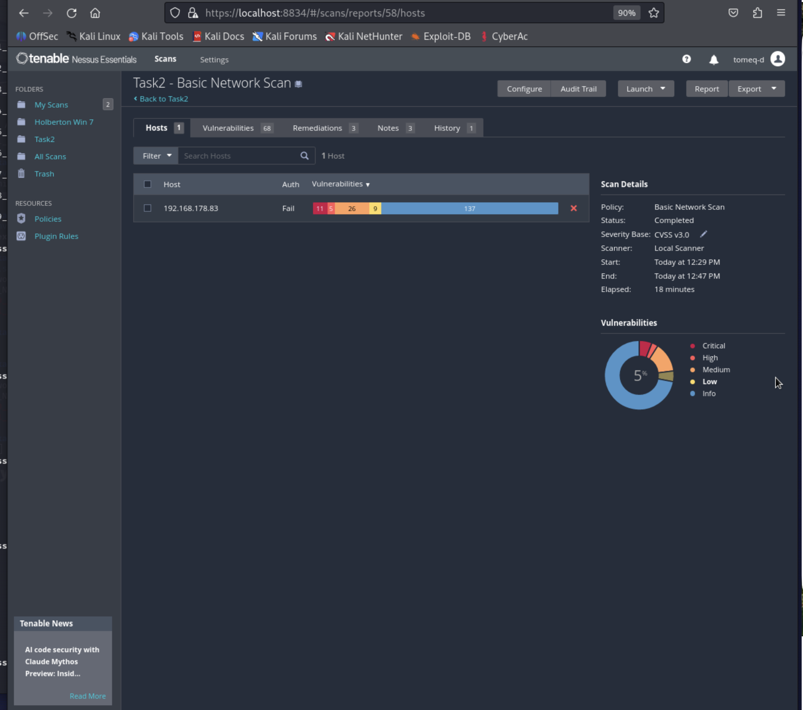
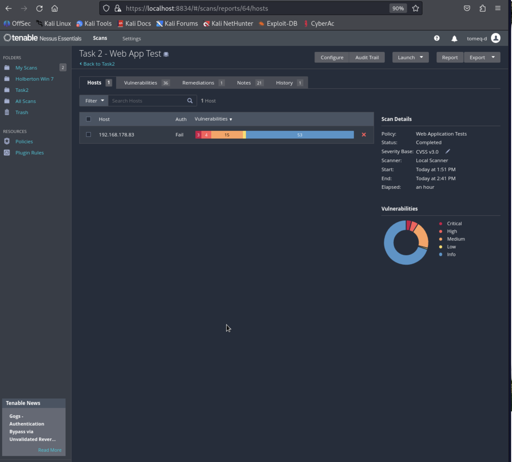
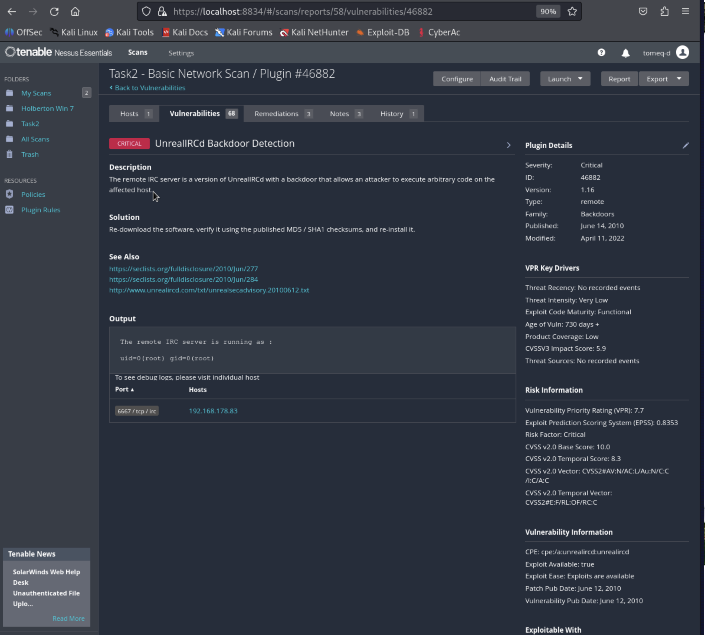
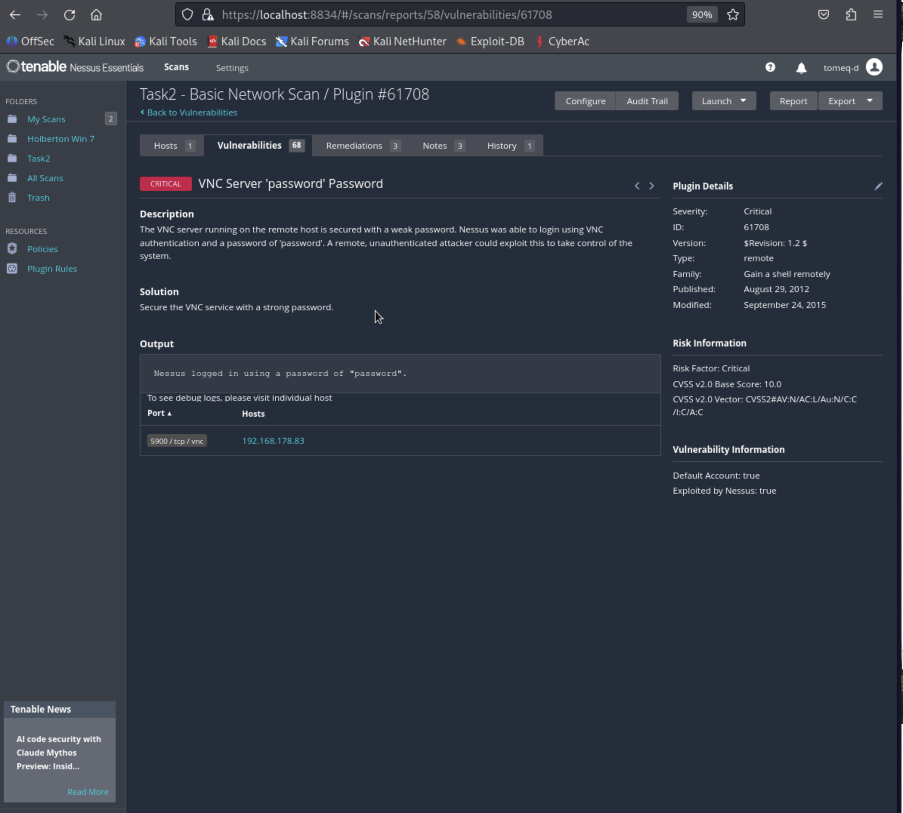
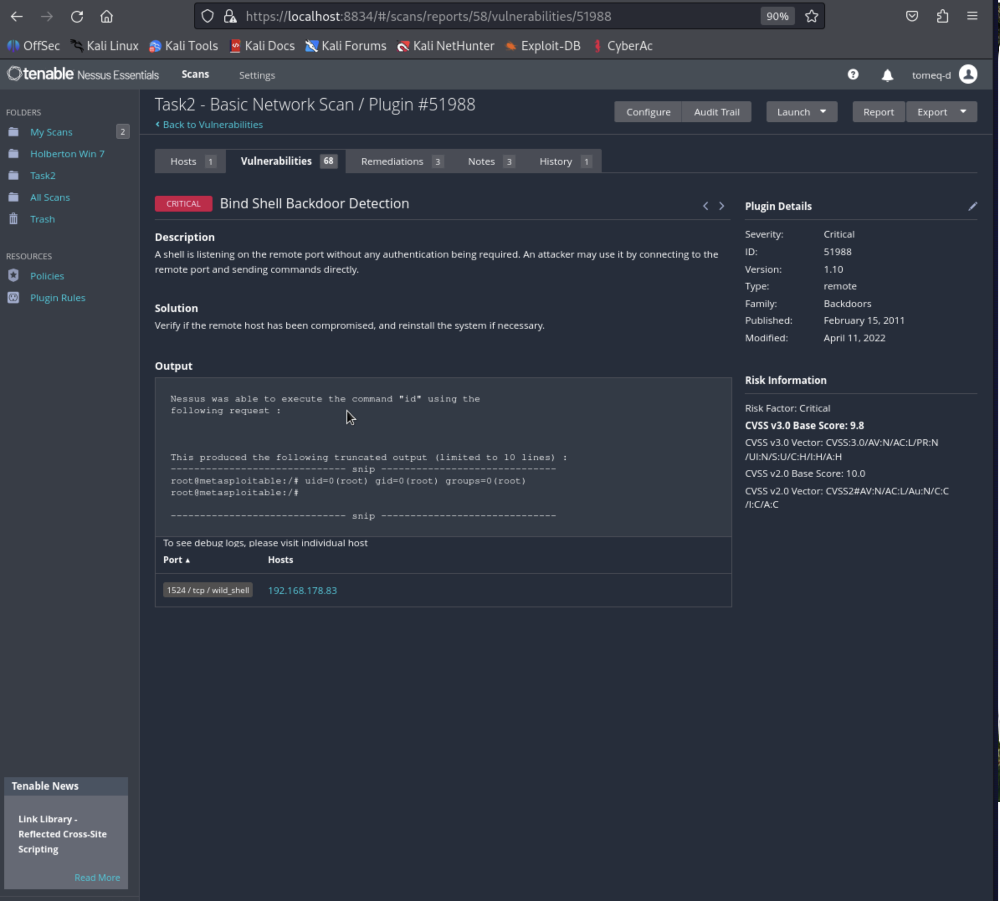
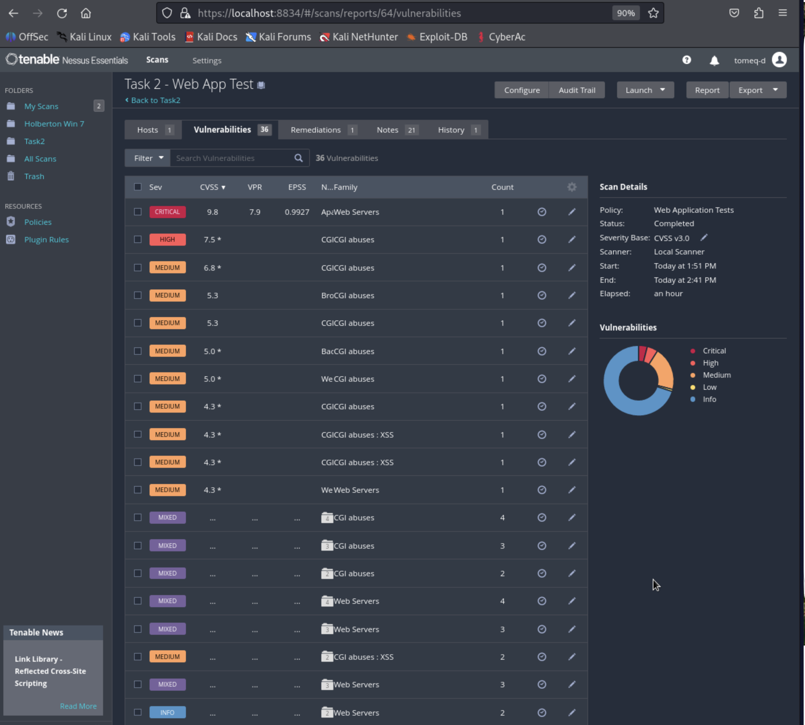

# Task 2 — Comparative Analysis: Nessus Basic vs Web Application Tests

*Comparing two Nessus scan templates against the same target*

## 3.1 Environment & Scan Configuration

| Field | Value |
|---|---|
| Nessus Version | Nessus Essentials 10.x |
| Common Target | Metasploitable 2 |
| Target IP | 192.168.178.83 |
| Scan A — Template | Basic Network Scan (unauthenticated) |
| Scan B — Template | Web Application Tests (unauthenticated, Custom mode) |
| Port Range (both scans) | Default |

**Environment note:** The task sheet's placeholder IP (192.168.56.3) is a VirtualBox host-only default. Metasploitable 2 was initially attached to a Host-only Adapter, which is unreachable from the separate Kali host — it was reconfigured to a **Bridged Adapter** (same fix applied to the Ubuntu VM in Task 1) before scanning could proceed, giving it the real address `192.168.178.83` reachable on the shared LAN.

**Note on Scan B setup:** Web Application Tests was run in **Custom** scan-type mode (rather than the default "quick" preset) with the web crawler's "Start crawling from" left at `/`, since Metasploitable 2 serves multiple vulnerable web applications (Mutillidae, TWiki, phpMyAdmin) directly off different paths from the site root, rather than a single dedicated app directory like Task 0's DVWA scan.

**Screenshot — Basic Network Scan results:**

**Screenshot — Web Application Tests results:**

---

## 3.2 Side-by-Side Results Comparison

| Metric | Basic Network Scan | Web Application Tests |
|---|---|---|
| Scan Duration | 18 minutes | 60 minutes |
| Critical Findings | 11 | 3 |
| High Findings | 5 | 4 |
| Medium Findings | 26 | 15 |
| Low Findings | 9 | ~1 |
| Informational | 137 | 53 |
| Total Findings | 188 | 76 |
| CVEs with CVSSv3 Scores | Multiple (e.g. Bind Shell Backdoor — CVSS v3.0 9.8) | Multiple (e.g. Ghostcat — CVE-2020-1938, CVSS v3.0 9.8) |
| Unique Findings | See 3.3 | See 3.3 |
| False Positives | 0 confirmed (manual validation recommended) | 0 confirmed (manual validation recommended) |

Basic Network Scan's near-3x higher Critical count and roughly 2.5x higher total finding count reflects Metasploitable 2's design — it's intentionally riddled with vulnerable network-level services (backdoored daemons, weak-credential remote access, unauthenticated shells) that a broad port/service scan is built to catch. Web Application Tests, despite running over 3x longer, returned fewer total findings because it deliberately narrows its scope to HTTP-layer application logic rather than sweeping every open port.

---

## 3.3 Analysis of Unique Findings

| Template | Finding Name / CVE | Severity | Why it was missed by the other scan |
|---|---|---|---|
| Basic Network Scan only | UnrealIRCd Backdoor Detection | Critical (CVSS 10.0) | Runs on port 6667/tcp/irc — entirely outside HTTP; Web Application Tests only probes web-facing ports and application logic. |
| Basic Network Scan only | VNC Server 'password' Password | Critical (CVSS 10.0) | Port 5900/tcp/vnc — a remote-access service requiring credential/authentication testing, not something a web crawler tests. |
| Basic Network Scan only | Bind Shell Backdoor Detection | Critical (CVSS 9.8) | Port 1524/tcp/wild_shell (the classic vsftpd 2.3.4 backdoor signature) — a raw, unauthenticated TCP shell with no HTTP component at all. |
| Web Application Tests only | Apache Tomcat AJP Connector Request Injection ("Ghostcat", CVE-2020-1938 / CVE-2020-1745) | Critical (CVSS 9.8) | Requires the AJP-protocol-aware exploitation plugin, part of the Web Application Tests plugin family; Basic Network Scan's default configuration and port range don't include AJP-specific request-injection checks. |
| Web Application Tests only | CGI Generic Remote File Inclusion (Mutillidae `page` parameter) | High (CVSS 7.5) | Only detectable by actively crawling the web app and fuzzing URL parameters with injected payloads — Basic Network Scan doesn't parse or test application-level input parameters. |
| Web Application Tests only | CGI Generic HTML Injections / reflected XSS (Mutillidae `page` and TWiki `template` parameters) | Medium (CVSS 4.3) | Same underlying reason: requires injecting test payloads into form/URL parameters and inspecting the rendered HTML response, entirely outside Basic Network Scan's scope. |

**Screenshot — Basic Network Scan finding detail (UnrealIRCd Backdoor):**

**Screenshot — Basic Network Scan finding detail (VNC weak password):**

**Screenshot — Basic Network Scan finding detail (Bind Shell Backdoor):**

**Screenshot — Web Application Tests vulnerability list:**

---

## 3.4 Template Comparison

| Criteria | Basic Network Scan | Web Application Tests | Notes |
|---|---|---|---|
| Scan Duration | 18 min | 60 min | Web App Tests took over 3x longer despite fewer total findings — it actively crawls, fuzzes parameters, and re-tests each discovered page, which is far more time-intensive per finding than a network/service sweep. |
| Types of Vulnerabilities | Network / Services (backdoors, weak remote-access credentials, exposed daemons) | Web / HTTP (RFI, XSS, AJP protocol injection) | Almost no overlap in finding categories — the two templates probe fundamentally different attack surfaces on the same host. |
| Plugins Used | Network discovery, port scanning, service fingerprinting, backdoor/credential checks | HTTP crawling, CGI abuse testing, form/parameter fuzzing, AJP-specific exploitation | Template selection directly determines which plugin families load — Web App Tests never triggers backdoor-detection plugins, and Basic Network Scan never triggers CGI/web-app fuzzing plugins. |
| Credentials Required | No (unauthenticated) | No (unauthenticated) | Both scans deliberately run without credentials for this comparison — see Task 1 for how credentialed scanning changes results on the same class of target. |
| Web Analysis Depth | Low — service/version detection only | High — full crawl, parameter fuzzing, live exploitation attempts (e.g. Ghostcat) | Basic Network Scan will note that a web server is running; Web Application Tests actively tests what's running on it. |
| Total Findings | 188 | 76 | Basic Network Scan's broader, shallower sweep naturally surfaces more raw findings across more services. |
| False Positive Rate | Not formally measured — 0 findings identified as false positives on manual review of the Critical/High set | Not formally measured — 0 findings identified as false positives on manual review of the Critical/High set | Both scans' top findings were independently corroborated by output evidence (e.g. actual root shell output, actual CVE match with exploited-by-Nessus confirmation for Ghostcat), giving high confidence they're genuine rather than false positives. |

**Summary:** The two templates answer fundamentally different questions about the same host. Basic Network Scan maps the full attack surface — every open port and exposed service — and is the right first pass for understanding what a host exposes to the network at large; its highest-severity findings here (UnrealIRCd, VNC, vsftpd backdoors) are all long-known, high-impact issues that any external attacker doing basic reconnaissance would find quickly. Web Application Tests ignores that broader surface entirely and instead interrogates the web application layer in depth, which is why it surfaced Ghostcat — a CVE on CISA's Known Exploited Vulnerabilities catalog, actively exploited in the wild (EPSS score of 0.99) — that Basic Network Scan's default configuration would never have tested for. In practice, the two are complementary rather than competing: Basic Network Scan for attack-surface mapping, Web Application Tests for any host found to be running a web application worth assessing properly.

---

## 3.5 Deep Dive — Ghostcat (Bonus)

Given its severity and real-world significance, the Web Application Tests scan's top finding is worth examining in detail.

| Field | Detail |
|---|---|
| Plugin Name | Apache Tomcat AJP Connector Request Injection (Ghostcat) |
| Plugin ID | 134862 |
| CVE ID | CVE-2020-1938, CVE-2020-1745 |
| CISA Known Exploited Vulnerabilities | Added 2022/03/17 |
| Severity / CVSS | Critical — CVSS v3.0 Base Score 9.8 (`CVSS:3.0/AV:N/AC:L/PR:N/UI:N/S:U/C:H/I:H/A:H`) |
| VPR / EPSS | VPR 7.9; EPSS 0.9927 — essentially certain to be under active, opportunistic exploitation in the wild |
| Plugin Family | Web Servers |
| Affected Host / Port | 192.168.178.83, port 8009/tcp/ajp13 |
| Exploited by Nessus | Yes — Nessus crafted a live AJP request and successfully read `/WEB-INF/web.xml` from the Tomcat server as proof |
| Description | A flaw in Tomcat's AJP connector lets a remote, unauthenticated attacker read arbitrary web application files. Where file uploads are also permitted, this can escalate to full remote code execution by uploading a malicious JSP file and then including it via the same AJP request-injection technique. |
| Remediation | Update the AJP connector configuration to require authorization, or upgrade Tomcat to 7.0.100, 8.5.51, 9.0.31, or later. |
| References | https://access.redhat.com/security/cve/CVE-2020-1745 |

This finding illustrates precisely why template choice matters: it lives on a non-standard port (8009, not 80/443), meaning it would be trivially missed by any scan that doesn't specifically test AJP as part of its web-application plugin set — exactly the gap Web Application Tests is designed to close.

---

## Deliverables Checklist

- [x] Both scans executed against Metasploitable 2 (192.168.178.83, reconfigured to Bridged networking to be reachable from the separate Kali host)
- [x] Results comparison table completed
- [x] Unique findings analysis completed
- [x] Template comparison completed
- [ ] Both Nessus reports exported (PDF/HTML) — *pending: same browser print-to-PDF workaround as Tasks 0 and 1 (Nessus Essentials blocks native export). Export both scans' Vulnerabilities tabs via `Ctrl+P → Save as PDF`.*
