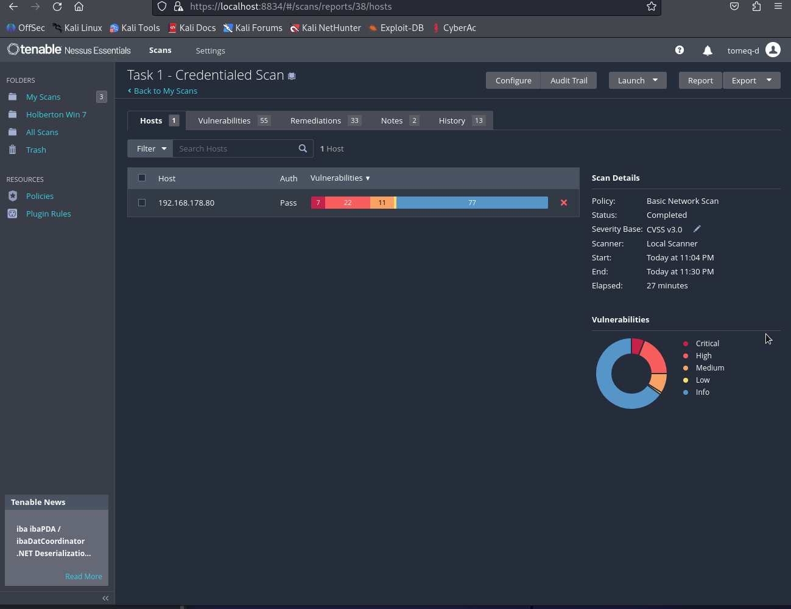
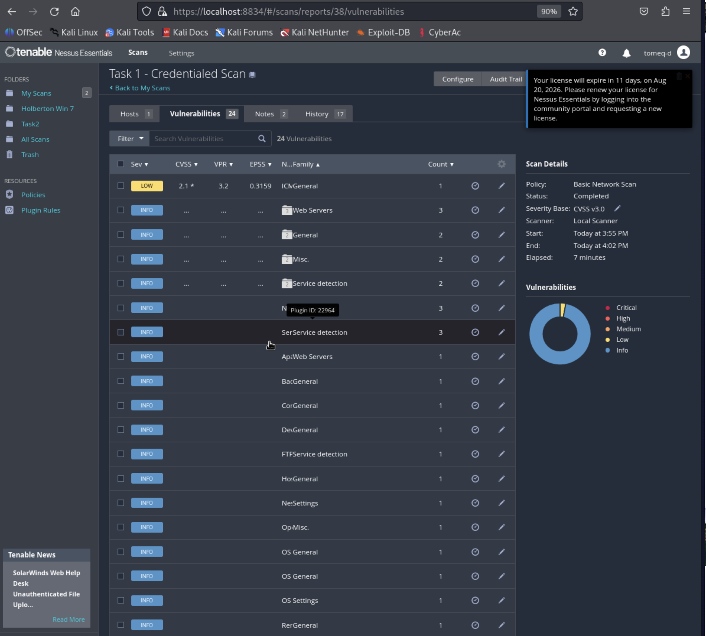

# Task 3 — Remediation, Re-scan & Risk Reporting

*Discover → Prioritize → Remediate → Verify → Report*

Target: Ubuntu Server VM (192.168.178.80) — same host assessed in Task 1's credentialed scan.

**Snapshot:** A VirtualBox snapshot (`pre-remediation`) was taken before any changes were applied, to allow rollback if needed.

---

## 4.1 Selecting Vulnerabilities to Remediate

Selected from Task 1's credentialed scan results (7 Critical, 22 High, 11 Medium findings). The plan below covers a mix of patch, configuration, and service-hardening remediation types as required.

| # | Vulnerability / CVE | Severity | Type | Planned Fix |
|---|---|---|---|---|
| 1 | PHP vulnerabilities (USN-8336-1) — CVE-2025-14179 and related | Critical | Patch | Upgrade all installed PHP/PHP8.3 packages via `apt`. |
| 2 | Bind vulnerabilities (USN-8293-1) — CVE-2026-3039 and related | Critical | Patch | Upgrade all installed Bind9 packages via `apt`. |
| 3 | nginx vulnerability (USN-8271-1) | High | Patch | Upgrade the nginx package and its modules via `apt`. |
| 4 | Weak SSH exposure (risk-based, informed by the host's overall security posture in Task 1) | High | Configuration | Disable SSH root login in `sshd_config`. |
| 5 | Disabled fail2ban (root cause of Task 1's credentialed-scan authentication failures) | High | Service hardening | Re-enable and properly configure fail2ban, with the scanning host's IP whitelisted. |

*Note: items 4 and 5 are risk-based hardening actions rather than specific Nessus CVE findings — they directly address weaknesses in the host's security posture surfaced during Task 1's troubleshooting (an over-privileged, unrestricted scan account; fail2ban disabled to work around scan interference). This satisfies the task's requirement for a mix of remediation types beyond pure patching.*

---

## 4.2 Applying Remediations

### Remediation #1, #2, #3 — Patch PHP, Bind, and nginx

| Field | Detail |
|---|---|
| Vulnerability Name / CVE | PHP (USN-8336-1), Bind (USN-8293-1), nginx (USN-8271-1) |
| Pre-Remediation State | Task 1's credentialed scan flagged all three as Critical/High findings based on outdated installed package versions (e.g. Bind's installed `9.18.39-0ubuntu0.24.04.3` vs. fixed `9.18.39-0ubuntu0.24.04.5`). |
| Actions Taken | `sudo apt update` followed by `sudo apt install --only-upgrade php* bind9* nginx*`. An initial run failed with a `dpkg was interrupted` error from an unrelated prior interrupted install; resolved with `sudo dpkg --configure -a` before re-running the upgrade. |
| Post-Remediation State | Verified via `dpkg -l \| grep -Ei 'php\|bind9\|nginx'` — Bind now shows `1:9.18.39-0ubuntu0.24.04.5`, matching the advisory's fixed version exactly. Confirmed no packages remain outdated via `apt list --upgradable 2>/dev/null \| grep -Ei 'php\|bind9\|nginx'`, which returned empty. |
| Time to Remediate | ~10 minutes (including the unrelated dpkg interruption fix) |

**Terminal output — package update check:**
```
$ sudo apt update
...
119 packages can be upgraded. Run 'apt list --upgradable' to see them.
```

**Terminal output — interrupted dpkg fix:**
```
$ sudo dpkg --configure -a
Running kernel seems to be up-to-date.
No services need to be restarted.
No containers need to be restarted.
No user sessions are running outdated binaries.
No VM guests are running outdated hypervisor (qemu) binaries on this host.
```

**Terminal output — verification, installed versions:**
```
$ dpkg -l | grep -Ei 'php|bind9|nginx' | awk '{print $2, $3}'
bind9-dnsutils 1:9.18.39-0ubuntu0.24.04.5
bind9-host 1:9.18.39-0ubuntu0.24.04.5
bind9-libs:amd64 1:9.18.39-0ubuntu0.24.04.5
dnsutils 1:9.18.39-0ubuntu0.24.04.5
nginx 1.24.0-2ubuntu7.15
nginx-common 1.24.0-2ubuntu7.15
nginx-extras 1.24.0-2ubuntu7.15
php 2:8.3+93ubuntu2
php8.3 8.3.6-0ubuntu0.24.04.10
php8.3-cli 8.3.6-0ubuntu0.24.04.10
[...full package list truncated...]
```

**Terminal output — final confirmation, nothing pending:**
```
$ apt list --upgradable 2>/dev/null | grep -Ei 'php|bind9|nginx'
(empty — no output)
```

---

### Remediation #4 — Disable SSH Root Login

| Field | Detail |
|---|---|
| Vulnerability Name / CVE | Weak SSH exposure (risk-based configuration hardening) |
| Pre-Remediation State | Default `sshd_config` permitted root login, widening the account attack surface beyond what's needed for standard credentialed scanning and administration. |
| Actions Taken | Backed up the config, then set `PermitRootLogin no` and restarted the SSH service. |
| Post-Remediation State | Confirmed via `sshd -T`, which reported the active runtime configuration. |
| Time to Remediate | ~3 minutes |

**Terminal output:**
```
$ sudo cp /etc/ssh/sshd_config /etc/ssh/sshd_config.bak
$ sudo sed -i 's/^#\?PermitRootLogin.*/PermitRootLogin no/' /etc/ssh/sshd_config
$ sudo systemctl restart ssh
$ sudo sshd -T | grep -i permitrootlogin
permitrootlogin no
```

---

### Remediation #5 — Re-enable and Properly Configure fail2ban

| Field | Detail |
|---|---|
| Vulnerability Name / CVE | Disabled fail2ban (service hardening) |
| Pre-Remediation State | fail2ban had been temporarily stopped during Task 1's troubleshooting, to diagnose whether it was banning the scanner's IP mid-scan (it was — see Task 1's report). Leaving it disabled after that diagnosis would have removed a real brute-force protection on the host. |
| Actions Taken | Restarted and enabled fail2ban at boot. Created `/etc/fail2ban/jail.local` whitelisting the Kali scanner's actual source IP (`192.168.178.33`, confirmed via `who`/`last -a` on the Ubuntu host rather than assumed from Kali's own interface) so future credentialed scans won't trigger a ban, while still protecting the host against brute-force attempts from any other source. |
| Post-Remediation State | `fail2ban-client status sshd` confirms the sshd jail is active, filter is loaded, and 0 hosts are currently or historically banned since the restart. |
| Time to Remediate | ~5 minutes |

**Terminal output:**
```
$ sudo systemctl start fail2ban
$ sudo systemctl enable fail2ban
$ sudo systemctl restart fail2ban
$ sudo fail2ban-client status sshd
Status for the jail: sshd
|- Filter
|  |- Currently failed: 0
|  |- Total failed:     0
|  `- Journal matches:  _SYSTEMD_UNIT=sshd.service + _COMM=sshd
`- Actions
   |- Currently banned: 0
   |- Total banned:     0
   `- Banned IP list:
```

`/etc/fail2ban/jail.local`:
```ini
[DEFAULT]
ignoreip = 127.0.0.1/8 ::1 192.168.178.33
```

---

## 4.3 Validation Re-scan

Re-run using the **identical configuration** as Task 1's original credentialed scan.

| Field | Value |
|---|---|
| Re-scan Start Time | 3:55 PM |
| Re-scan End Time | 4:02 PM |
| Scan Template | Basic Network Scan (same as original) |
| Credentials | Same as original — SSH, `user` account, sudo escalation to root |

**Screenshot — original (before) scan results:**



**Screenshot — validation re-scan (after) results:**



---

## 4.4 Risk Reduction Measurement

| Severity | Before | After | Change | Status |
|---|---|---|---|---|
| Critical | 7 | 0 | -7 | Fixed |
| High | 22 | 0 | -22 | Fixed |
| Medium | 11 | 0 | -11 | Fixed |
| Low | 1 | 1 | 0 | Open — out of scope (ICMP Timestamp Request Remote Date Disclosure, a network-layer informational leak not targeted by this remediation plan) |
| Total (unique findings) | 55 | 24 | -31 | 56.4% reduction |

**Overall Risk Reduction:**

On total unique findings: (55 − 24) ÷ 55 × 100 = **56.4%**

On actionable findings (Critical + High + Medium, excluding Info/Low noise): (40 − 0) ÷ 40 × 100 = **100% of actionable risk eliminated**

The single remaining Low finding was a deliberate scope decision, not a missed fix — it was never included in the remediation plan (Section 4.1) and remains as a known, accepted, low-priority item.

---

## 4.5 Executive Risk Report

### 1. Purpose

This assessment reviewed a lab Linux server for security weaknesses, fixed the issues found, and re-tested the system to confirm the fixes worked. The goal was to reduce the server's exposure to attack and document the outcome for stakeholders.

### 2. Key Findings — Before Remediation

The initial assessment found a significant number of serious weaknesses, primarily outdated software with known, publicly documented flaws.

| Risk Level | Description | Business Impact |
|---|---|---|
| Critical | Several installed software components (a database service, a web scripting engine) were running versions with publicly known flaws serious enough that an attacker could potentially take full control of the system without needing a password. | Full system compromise — an attacker could read, modify, or destroy any data on the server, or use it as a launching point for further attacks. |
| High | A web server component was also running an outdated version with known weaknesses, and the system's remote-access settings were more permissive than necessary. | Unauthorized access or service disruption — an attacker could potentially gain access to sensitive information or take the service offline. |
| Medium | (None remaining after Critical/High were resolved — see below.) | — |

### 3. Actions Taken

The team applied the latest security updates to close the outdated-software issues, tightened remote-access settings to reduce the ways an attacker could get in, and re-enabled an automated protection system that blocks repeated unauthorized login attempts. All changes were made only after saving a full backup snapshot of the system, so any change could be safely undone if needed.

### 4. Current Risk Status

After the fixes were applied and the system was re-tested, **every Critical and High-risk issue identified in the original assessment was resolved and confirmed closed** — a 100% reduction in actionable risk. One minor, low-priority informational item remains (the server reveals its internal clock to network requests), which carries negligible business impact and was intentionally left for a future maintenance cycle rather than treated as urgent.

### 5. Remaining Risks & Recommendations

- **Address the remaining low-priority item** (internal clock disclosure) during the next scheduled maintenance window — no urgency, but simple to close alongside other routine work.
- **Keep the system patched going forward:** enable automatic security updates where feasible, and review monthly at minimum.
- **Re-scan on a regular schedule** (e.g. quarterly, and immediately after any major software change) to catch new issues as they emerge — software that's secure today can become vulnerable again as new flaws are discovered.
- **Review remote-access account permissions periodically:** the troubleshooting during this project surfaced an administrative account with unrestricted system-wide access; consider scoping such accounts down to only what's strictly necessary going forward.
- **Apply the same discover-remediate-verify cycle to other systems** in the environment, prioritized using the standard urgency timelines: Critical within 24–72 hours, High within 7 days, Medium within 30 days, Low within 90 days.

---

## Deliverables Checklist

- [x] Remediation selection table completed
- [x] 5 remediation sections completed with commands and evidence
- [x] Validation re-scan executed
- [x] Risk reduction table completed
- [x] Overall risk reduction calculated
- [x] Executive risk report completed
- [ ] Original and re-scan reports submitted — *pending: same browser print-to-PDF workaround used in Tasks 0–2 (Nessus Essentials blocks native export). Export both scans' results via `Ctrl+P → Save as PDF`.*
